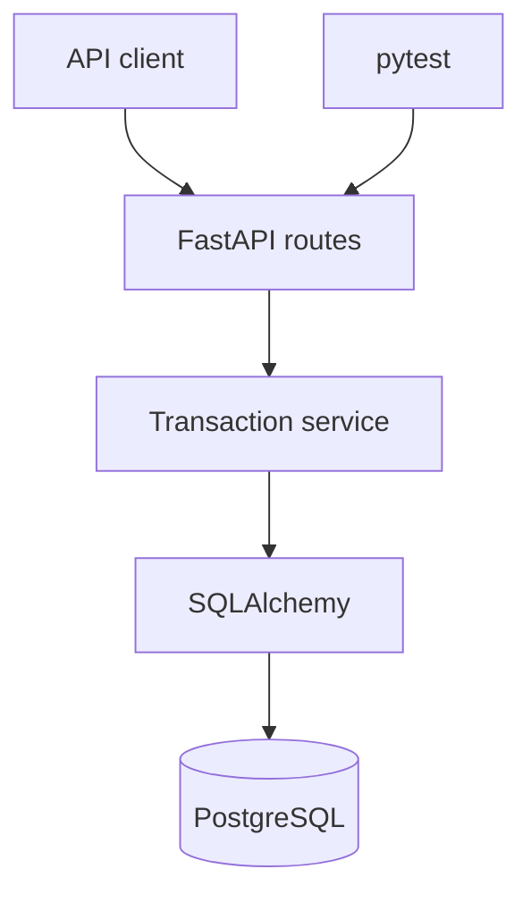

# FinFlow Transaction Processing API

FinFlow is a backend service for managing customers, accounts and financial transactions. It demonstrates transaction-safe balance updates, relational data modelling, validation, automated testing and containerised deployment.

## Why this project exists

People routinely retry a payment when a slow or unstable connection makes it unclear whether
the first request succeeded. A naive system can apply that request twice, debit only one side of
a transfer or leave balances inconsistent.

FinFlow is a self-initiated learning project that explores how a small financial API can handle
those failure conditions deliberately. It keeps deposits, withdrawals and transfers inside
database transactions, rejects invalid operations, locks account rows during balance changes and
uses idempotency keys to make client retries safe. It is an educational prototype, not a real
banking product.

## Current features

- Create and list customers
- Create and retrieve multi-currency accounts
- Paginated customer, account and transaction listings
- Account-specific transaction statements
- Deposit and withdraw funds
- Transfer funds between accounts using the same currency
- Idempotency keys that make retried money operations safe
- Prevent overdrafts and self-transfers
- Store money with fixed decimal precision
- Lock account rows while balances are updated
- Interactive OpenAPI documentation
- Recruiter-friendly interactive browser demo
- Automated API tests and GitHub Actions CI
- Docker Compose development environment with PostgreSQL
- Automatic database bootstrap for the first development milestone
- Request IDs and structured request-completion logs

## Architecture



The routes handle HTTP input and output. Business rules live in the transaction service, while SQLAlchemy manages persistence. This separation keeps the core logic easier to test and extend.

## Technology stack

- Python 3.12
- FastAPI and Pydantic
- PostgreSQL
- SQLAlchemy 2
- pytest
- Docker and Docker Compose
- GitHub Actions

## Run with Docker

```bash
docker compose up --build
```

Open:

- Interactive demo: `http://localhost:8000/demo`
- API documentation: `http://localhost:8000/docs`
- Health endpoint: `http://localhost:8000/health`

## Run tests locally

```bash
python -m venv .venv
```

Windows PowerShell:

```powershell
.venv\Scripts\Activate.ps1
pip install -r requirements-dev.txt
pytest -q
```

The test suite uses an isolated in-memory SQLite database for fast feedback. Docker runs the application against PostgreSQL.

## Example workflow

1. `POST /api/v1/customers`
2. `POST /api/v1/accounts`
3. `POST /api/v1/transactions/accounts/{account_id}/deposit`
4. `POST /api/v1/transactions/transfer`
5. `GET /api/v1/transactions`

Complete request schemas and example payloads are available in Swagger UI.

### Example transfer request

```bash
curl -X POST http://localhost:8000/api/v1/transactions/transfer \
  -H "Content-Type: application/json" \
  -H "Idempotency-Key: transfer-2026-0001" \
  -d '{
    "source_account_id": "SOURCE_ACCOUNT_UUID",
    "destination_account_id": "DESTINATION_ACCOUNT_UUID",
    "amount": "250.00",
    "reference": "Shared groceries"
  }'
```

For a visual walkthrough, open `/demo` and select **Create demo scenario**. FinFlow will
create two temporary customers, fund one account and make a transfer while showing the
resulting balances and API activity. You can then send additional transfers from the page.

## Load demonstration data

With the local SQLite configuration active, run:

```bash
python -m scripts.seed_demo
```

The script creates two customers and accounts, deposits ZAR 1,000 and transfers ZAR 250.

## Transaction integrity

- Amounts must be positive and have no more than two decimal places.
- Balances cannot become negative.
- Transfers require accounts with matching currencies.
- Source and destination account rows are locked in deterministic order.
- Balance changes and transaction records commit together.
- Clients can send an `Idempotency-Key` header so a network retry cannot apply the same
  deposit, withdrawal or transfer twice. Reusing a key with different inputs is rejected.

## Engineering decisions

| Decision | Reason | Trade-off |
| --- | --- | --- |
| `Decimal` and `NUMERIC(18, 2)` for money | Avoid binary floating-point rounding errors | This prototype supports two-decimal currencies only |
| Service layer separate from API routes | Keeps business rules testable without mixing them with HTTP concerns | Adds a small amount of structure to a compact application |
| Deterministic row-lock order | Reduces deadlock risk when two accounts are updated | Row locking depends on database support; SQLite tests validate rules, not PostgreSQL lock behaviour |
| Client-supplied idempotency keys | Makes network retries safe without applying a payment twice | Production systems also need expiry, ownership and storage policies for keys |
| SQLite for automated tests, PostgreSQL for Docker | Keeps the test suite fast while demonstrating a production-oriented relational database | PostgreSQL-specific behaviour still needs integration tests |

## Limitations and next steps

FinFlow deliberately focuses on transaction integrity rather than pretending to be production-ready.
It does not yet include authentication, authorisation, fraud controls, encryption-key management,
audit retention, rate limiting, database migrations or PostgreSQL integration tests. The public demo
uses disposable data and must never receive real personal or financial information.

The next engineering milestones are:

1. Add Alembic migrations and PostgreSQL integration tests.
2. Associate idempotency keys with authenticated clients and define an expiry policy.
3. Add role-based access control and an immutable audit trail.
4. Publish service metrics for latency, failures and transaction outcomes.

## Try it and share feedback

The quickest review path is the interactive `/demo` page. Testers are asked to try the normal
transfer flow, an overdraft and a repeated request, then comment on what was clear, confusing or
missing. Feedback and resulting changes will be recorded in repository issues so the evolution of
the project remains visible.

## Roadmap

- Alembic database migrations
- Authentication and authorisation
- Background event processing
- Metrics and production deployment

## Author

Zandile Dladla

- Portfolio: https://zandiledladla.github.io
- GitHub: https://github.com/zandiledladla
