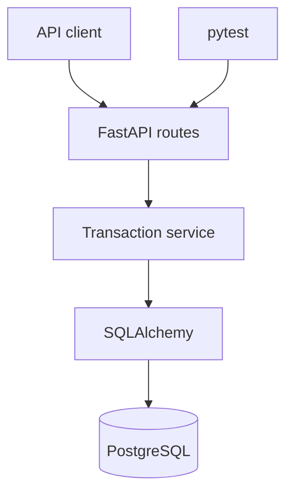

# FinFlow Transaction Processing API

FinFlow is a backend service for managing customers, accounts and financial transactions. It demonstrates transaction-safe balance updates, relational data modelling, validation, automated testing and containerised deployment.

## Why this project exists

Financial systems must protect data integrity even when a transaction fails. FinFlow keeps deposits, withdrawals and transfers inside database transactions, rejects invalid operations and locks account rows during balance changes.

## Current features

- Create and list customers
- Create and retrieve multi-currency accounts
- Paginated customer, account and transaction listings
- Account-specific transaction statements
- Deposit and withdraw funds
- Transfer funds between accounts using the same currency
- Prevent overdrafts and self-transfers
- Store money with fixed decimal precision
- Lock account rows while balances are updated
- Interactive OpenAPI documentation
- Automated API tests and GitHub Actions CI
- Docker Compose development environment with PostgreSQL
- Automatic database bootstrap for the first development milestone
- Request IDs and structured request-completion logs

## Architecture



The routes handle HTTP input and output. Business rules live in the transaction service, while SQLAlchemy manages persistence. This separation keeps the core logic easier to test and extend.

## Technology stack

- Python 3.12
- FastAPI and Pydantic
- PostgreSQL
- SQLAlchemy 2
- pytest
- Docker and Docker Compose
- GitHub Actions

## Run with Docker

```bash
docker compose up --build
```

Open:

- API documentation: `http://localhost:8000/docs`
- Health endpoint: `http://localhost:8000/health`

## Run tests locally

```bash
python -m venv .venv
```

Windows PowerShell:

```powershell
.venv\Scripts\Activate.ps1
pip install -r requirements-dev.txt
pytest -q
```

The test suite uses an isolated in-memory SQLite database for fast feedback. Docker runs the application against PostgreSQL.

## Example workflow

1. `POST /api/v1/customers`
2. `POST /api/v1/accounts`
3. `POST /api/v1/transactions/accounts/{account_id}/deposit`
4. `POST /api/v1/transactions/transfer`
5. `GET /api/v1/transactions`

Complete request schemas and example payloads are available in Swagger UI.

## Load demonstration data

With the local SQLite configuration active, run:

```bash
python -m scripts.seed_demo
```

The script creates two customers and accounts, deposits ZAR 1,000 and transfers ZAR 250.

## Transaction integrity

- Amounts must be positive and have no more than two decimal places.
- Balances cannot become negative.
- Transfers require accounts with matching currencies.
- Source and destination account rows are locked in deterministic order.
- Balance changes and transaction records commit together.

## Roadmap

- Alembic database migrations
- Idempotency keys to prevent duplicate payments
- Transaction pagination and account statements
- Authentication and authorisation
- Background event processing
- Metrics and production deployment

## Author

Zandile Dladla

- Portfolio: https://zandiledladla.github.io
- GitHub: https://github.com/zandiledladla
